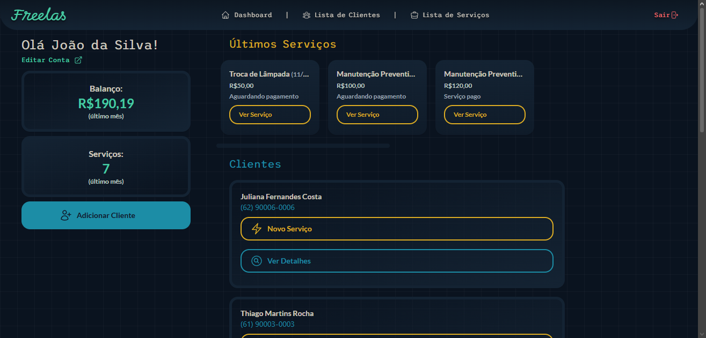
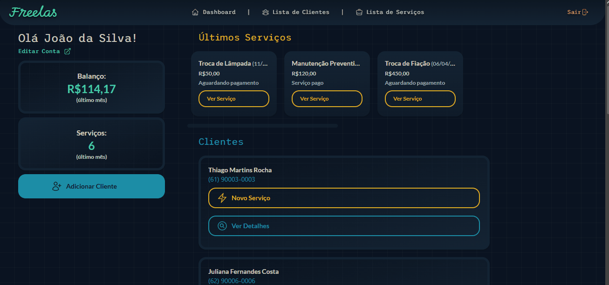
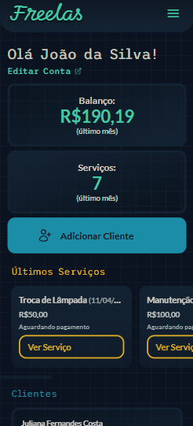
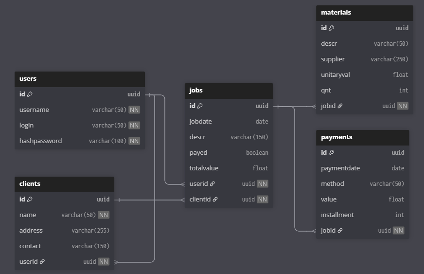

# Freelas

Freelas is a full-stack freelance work manager for organizing clients, jobs, materials, payments, and monthly performance.

The application is currently organized as an npm workspace monorepo:

- [`apps/api`](./apps/api) contains the Express and PostgreSQL API.
- [`packages/shared`](./packages/shared) contains shared Zod schemas and types.
- [`packages/legacy-frontend`](./packages/legacy-frontend) contains the legacy EJS frontend and its static assets.

## Features

- User registration and login with JWT authentication stored in an HTTP-only cookie.
- Client management with ownership checks.
- Job management connected to clients and users.
- Materials and payments associated with jobs.
- Search and pagination for clients and jobs.
- Dashboard data including recent jobs, clients, monthly profit, and job counts.
- Responsive legacy frontend for desktop and mobile workflows.

## Current architecture

The API follows a layered structure:

```text
Routes -> Middleware -> Controllers -> Services -> DAOs -> PostgreSQL
```

- **Routes** compose validation, JWT authentication, and resource authorization.
- **Controllers** translate HTTP requests into service calls and responses.
- **Services** contain business rules and coordinate data access.
- **DAOs** execute parameterized PostgreSQL queries.
- **Shared schemas** provide reusable Zod validation across workspace packages.

JWT authentication is implemented in [`features/auth`](./apps/api/src/features/auth). Authenticated requests expose the validated token claims through `req.user`.

## Preview

### Desktop





### Mobile



The deployed application is available at [freelas.up.railway.app](https://freelas.up.railway.app).

## Database

The current data model connects users to clients and jobs, with materials and payments belonging to jobs.



## Getting started

### Requirements

- Node.js
- npm
- PostgreSQL

Install dependencies from the repository root:

```bash
npm install
```

Copy [`apps/api/.env.example`](./apps/api/.env.example) to `apps/api/.env` and configure the database and JWT variables before starting the API.

Run the API in development mode:

```bash
npm run dev:api
```

Run database migrations:

```bash
npm run migrate
```

Run the API test suite:

```bash
npm run test:api
```

## Documentation

- [Legacy project README](./docs/legacy/README.md)
- [Shared package](./packages/shared/)
